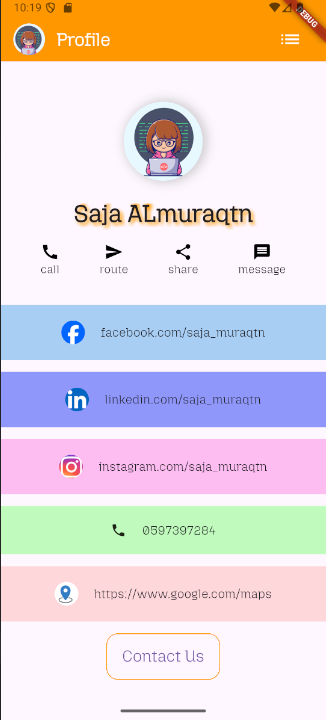

# Profile App - Flutter

This is a simple **Flutter Profile App** showcasing a user profile with social media links and contact options. 

#📌 Widgets Used in the Project

MaterialApp → The root of the application that provides Material Design styling.

Scaffold → The main layout structure that provides AppBar, Body, and other screen elements.

AppBar → A top bar that contains the profile title, avatar, and action icons.

CircleAvatar → Used to display profile and social media icons in a circular shape.

Text → Displays different pieces of text such as the profile name and social links.

Row & Column → Layout widgets to arrange elements horizontally (Row) and vertically (Column).

Container → Used for styling sections with padding, margin, decoration, and background colors.

Icon → Shows different action icons like call, share, and message.

TextButton → A styled button for "Contact Us" functionality.

SingleChildScrollView → Allows scrolling if the content exceeds the screen size.

BoxDecoration & BoxShadow → Used for styling profile image and containers with shadows and rounded corners.

## Final Result

